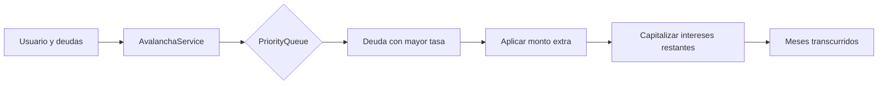

# Avalancha API


Motor de simulación para priorizar el pago de deudas personales mediante el método **avalancha**: se atiende primero la deuda con mayor tasa de interés para reducir el costo financiero total y estimar el tiempo necesario para quedar libre de obligaciones.

> Proyecto de portafolio orientado a problemas reales de inclusión y salud financiera. Está diseñado como una base técnica para evolucionar hacia un servicio bancario responsable, seguro y fácil de explicar al usuario.

## Por qué importa

Las personas con varias obligaciones suelen necesitar algo más que una lista de saldos: necesitan entender qué decisión reduce más rápido el costo de su deuda. Avalancha API convierte esa decisión en una simulación reproducible y auditable.

El proyecto demuestra:

- Modelado de usuario y obligaciones financieras con `BigDecimal`.
- Priorización determinista por tasa de interés usando `PriorityQueue`.
- Separación inicial entre dominio, aplicación e infraestructura.
- Una base preparada para incorporar validación, persistencia, API REST y observabilidad.

## Estado actual

El repositorio contiene el núcleo de simulación en `AvalanchaService` y un modelo de dominio inicial. La aplicación Spring Boot arranca correctamente y cuenta con una prueba de carga de contexto.

### Implementado

- Cálculo iterativo de meses transcurridos.
- Priorización de la deuda con mayor tasa de interés.
- Aplicación del monto extra mensual al saldo pendiente.
- Capitalización mensual de intereses sobre las deudas restantes.
- Modelos `Usuario` y `DeudaUsuario`.

### En construcción

- Controlador REST y contratos de entrada/salida.
- Validación de montos, tasas, cuotas y datos obligatorios.
- Persistencia con PostgreSQL y repositorios JPA.
- Pruebas unitarias del algoritmo y pruebas de integración.
- Autenticación, autorización, trazabilidad y manejo uniforme de errores.

## Diseño actual



La regla de negocio vive en el servicio de aplicación y la prioridad se define en `DeudaUsuario`. Esto facilita reemplazar la entrada actual por un endpoint REST sin mezclar transporte HTTP con el cálculo financiero.

## Requisitos

- Java 21+
- Maven 3.9+ o el Maven Wrapper incluido
- PostgreSQL será necesario cuando se habilite la persistencia; el MVP actual no requiere una base de datos para arrancar

## Ejecutar localmente

Clona el repositorio y entra en su carpeta:

```bash
git clone <URL_DEL_REPOSITORIO>
cd avalache-api
```

Ejecuta las pruebas:

```bash
./mvnw test
```

Inicia la aplicación:

```bash
./mvnw spring-boot:run
```

En Windows puedes usar `mvnw.cmd` en lugar de `./mvnw`.

> Actualmente no hay endpoints publicados. El arranque permite validar la configuración de Spring; la interacción HTTP se incorporará en la siguiente iteración.

## Ejemplo conceptual del dominio

El motor recibe un usuario con un monto adicional mensual y una colección de deudas. Cada deuda contiene saldo, pago mínimo, número de cuotas y tasa de interés.

```java
var deudas = List.of(
    new DeudaUsuario(
        "Tarjeta de crédito",
        new BigDecimal("2500000"),
        new BigDecimal("150000"),
        24,
        new BigDecimal("0.025")
    ),
    new DeudaUsuario(
        "Crédito de libre inversión",
        new BigDecimal("6000000"),
        new BigDecimal("300000"),
        36,
        new BigDecimal("0.015")
    )
);

var usuario = new Usuario(
    "cliente-demo",
    deudas,
    new BigDecimal("4500000"),
    new BigDecimal("500000")
);

Integer meses = avalanchaService.ejecutarAvalancha(usuario);
```

Las tasas del ejemplo son valores mensuales expresados como proporciones decimales. En una API pública se documentará y validará de forma explícita la unidad de cada tasa para evitar interpretaciones incorrectas.

## Estructura del proyecto

```text
src/main/java/com/avalache_api/demo/
├── application/       # Casos de uso y reglas de aplicación
├── domain/             # Usuario, deuda y reglas de prioridad
└── infrastructure/     # DTOs y futura entrada HTTP/persistencia
```

## Hoja de ruta técnica

1. **Contrato de API:** añadir `POST /api/v1/simulaciones`, DTOs inmutables, validación y una respuesta con plan de pagos, meses estimados e intereses proyectados.
2. **Corrección financiera:** definir con el negocio la fórmula de interés, pagos mínimos, redondeo, fechas de corte y casos de saldo cero antes de exponer resultados a usuarios.
3. **Calidad:** cubrir casos límite con JUnit, pruebas de integración, análisis estático y un pipeline de integración continua.
4. **Persistencia:** incorporar PostgreSQL mediante migraciones versionadas, repositorios y separación entre entidades y dominio.
5. **Seguridad y operación:** autenticación, autorización, protección de datos personales, logs estructurados, métricas, trazas y límites de consumo.
6. **Entrega:** empaquetar en contenedor, desplegar en un entorno cloud y publicar documentación versionada junto con el contrato OpenAPI.

## Documentación y deployment futuro

La evolución recomendada es separar dos necesidades:

- **Documentación de API:** generar `openapi.yaml` desde el contrato y servir Swagger UI para que un desarrollador pueda probar cada operación.
- **Documentación del producto y arquitectura:** construir un sitio con MkDocs Material o Docusaurus, incluyendo decisiones técnicas, modelo de dominio, reglas financieras, diagramas y guías de operación.

Una primera publicación de bajo costo puede usar **GitHub Pages** mediante GitHub Actions:

1. Mantener los documentos en `docs/` y el contrato en `docs/openapi.yaml`.
2. Configurar MkDocs para construir el sitio estático.
3. Ejecutar `mkdocs build --strict` en cada pull request para detectar enlaces o referencias rotas.
4. Publicar el directorio `site/` en GitHub Pages desde una rama o mediante Pages Artifact.
5. Versionar la documentación cuando cambie el contrato (`/docs/v1/`, `/docs/v2/`).

Para un entorno más cercano a producción, el mismo sitio puede publicarse detrás de un dominio corporativo y un CDN. La documentación nunca debe incluir credenciales, datos reales de clientes ni ejemplos que expongan información personal.

## Principios para una evolución bancaria

- **Privacidad por diseño:** usar datos sintéticos y minimizar la información personal almacenada.
- **Explicabilidad:** mostrar por qué una deuda fue priorizada y qué supuestos produjo el resultado.
- **Precisión:** representar dinero con `BigDecimal`, documentar moneda, escala y reglas de redondeo.
- **Trazabilidad:** conservar versión del algoritmo, fecha de simulación y parámetros utilizados.
- **Responsabilidad:** presentar el resultado como una simulación educativa y validarlo con expertos financieros antes de usarlo para decisiones reales.

## Contribuir

Las contribuciones deben incluir una descripción del caso de uso, pruebas para cambios de reglas financieras y una nota sobre cualquier impacto en el contrato público. Para cambios relevantes, abrir primero un issue con la propuesta técnica.

## Licencia

La licencia todavía no ha sido definida. Antes de publicar el repositorio como código abierto, añadir una licencia explícita y revisar qué partes del proyecto pueden compartirse públicamente.

## Autor

Proyecto desarrollado como demostración de ingeniería backend con Java y Spring Boot, enfocado en convertir un problema financiero cotidiano en una solución clara, medible y evolutiva.